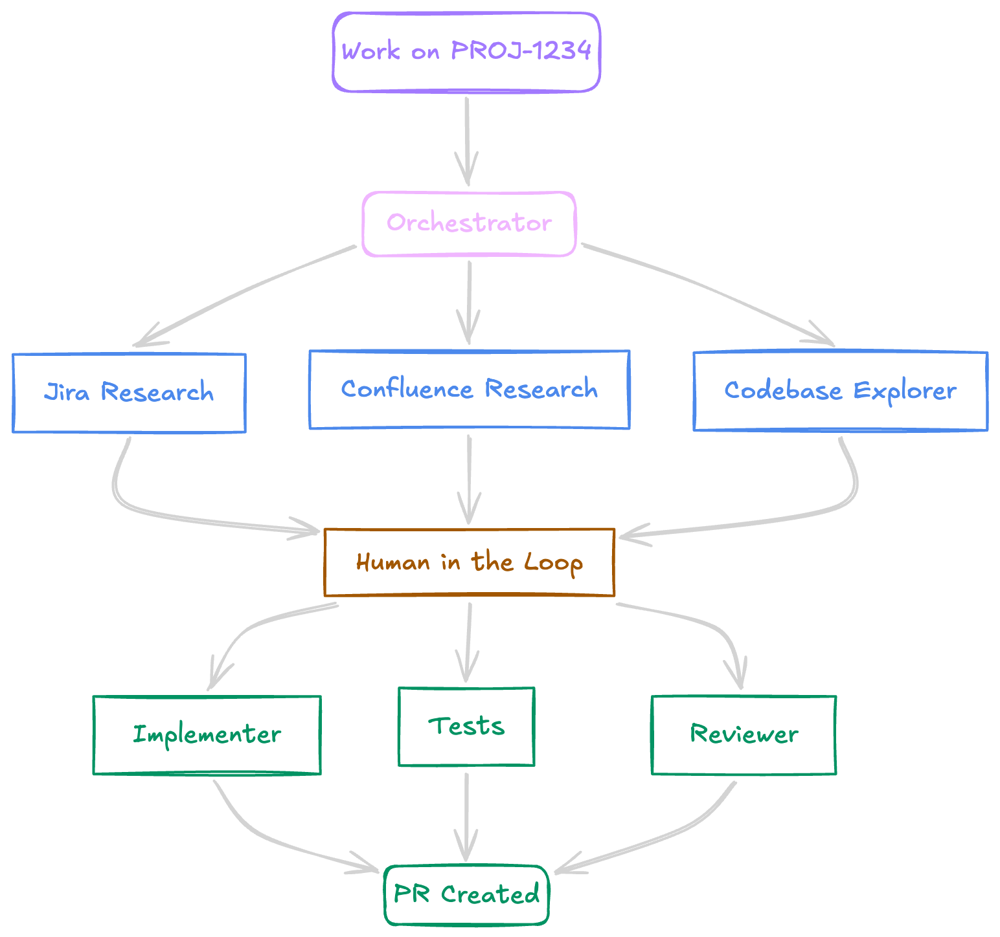
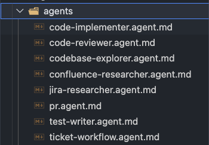
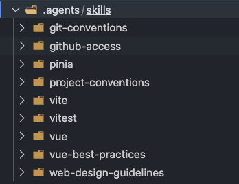
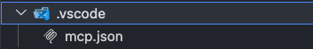
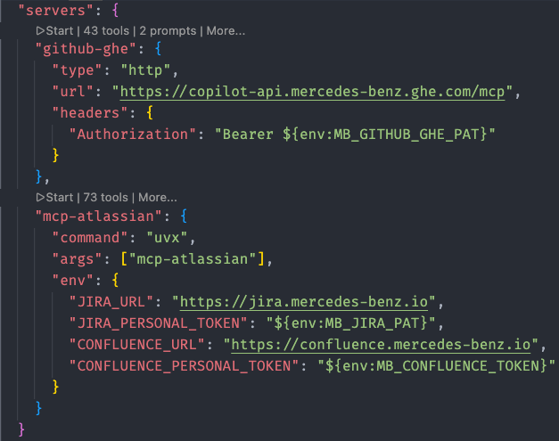

<!-- .slide: class="center-slide" -->

## Live feedback

ANONYMOUS

---

<!-- .slide: class="center-slide" -->

## How every task starts

📋

Read ticket

→

📄

Check specs

→

🎨

Review designs

→

💻

Explore code

⌨️

Write code

→

🧪

Write tests

→

🔀

Create PR

Most of the time isn't coding. It's context-engineering.

<aside class="notes">

- "Raise your hand if this looks familiar."
- Walk through each step as it appears — keep it conversational
- Land on the last line and let it sit: "Most of our time is everything around the code, not the code itself."

</aside>

---

<!-- .slide: class="center-slide" -->

## The overhead no one talks about

🔄

Context switching

Between 5+ tools before writing a line

🧠

Mental overhead

Re-building context every single time

📋

Repetitive setup

Before any real engineering begins

What if the context-engineering just happened automatically?

<aside class="notes">

- "It's not one big task. It's 20 small interruptions before you write a single line."
- The three cards name what everyone feels but rarely says out loud — let each land
- Pause on the closing question — it's the setup for everything that follows

</aside>

---

<!-- .slide: class="center-slide" -->

## So I built something

An AI workflow that gathers the information and engineer the context.

<aside class="notes">

- Drop the tone here. Plain statement, not a pitch.
- "I want to show you what that looks like — input first."

</aside>

---

<!-- .slide: class="center-slide" data-auto-animate -->

## Input

<blockquote class="callout callout--info">
PROMPT
Work on USGMMV-1234
</blockquote>

<aside class="notes">

- Just the ticket number. Let it land.
- "That's everything I type."

</aside>

---

<!-- .slide: class="center-slide" data-auto-animate -->

## Output

<blockquote class="callout callout--success">
RESULT
Context gathered. Code written. PR created.
</blockquote>

<aside class="notes">

- "That's the goal. Not magic — just the boring parts handled automatically."
- "Let me show you how."

</aside>

---

<!-- .slide: class="center-slide" -->

## The system behind it

<aside class="notes">

- Walk through the diagram top to bottom
- "One orchestrator. It reads the ticket and decides what needs to happen."
- "Three research agents run in parallel — Jira, Confluence, codebase."
- "Then it stops. Human in the loop — I review the context summary before any code is written."
- "Only then do the implementation agents start. And the result is a PR."
- "It's not autonomous. It's collaborative."

</aside>

---

<!-- .slide: class="center-slide" -->

## What it actually looks like

WHAT THE SYSTEM HANDLES

Fetches the ticket

Pulls relevant Confluence docs

Explores the codebase

Writes and reviews code

Opens the PR

WHAT STAYS WITH YOU

Reviewing the context summary

Answering edge case questions

Guiding implementation decisions

Approving before merge

Engineering judgment

<!-- 

The boring parts are automated. The interesting parts stay yours.

 -->

<aside class="notes">

- "This isn't magic. It asks questions. You still make decisions."
- "What's gone is the 45 minutes of opening tabs before you write a line."
- Build left column first, then right — audience sees the balance before the closing line

</aside>

---

<!-- .slide: class="center-slide" -->

## Four building blocks

🤖

Agents

who does the work

⚡

Prompts

how you trigger it

📚

Skills

what they know

🔌

MCPs

where they get data

<!-- 

All of it is markdown files and one JSON config. Nothing exotic.

 -->

<aside class="notes">

- "So how is this actually built? Four pieces."
- Name each as it appears: "Agents are the workers. Prompts are how you trigger them. Skills are shared knowledge. MCPs connect to external tools."
- "All of this lives in your repo. No special tooling."

</aside>

---

<!-- .slide: class="center-slide" -->

## One responsibility per agent

Started with one big agent that did everything

↓

Unreliable. Hard to debug. Unpredictable.

↓

Split into specialists

↓

Predictable. Debuggable. Each usable standalone.

<aside class="notes">

- "Same principle as clean code: single responsibility."
- "The test-writer runs on its own — you don't need the full pipeline to use it."

</aside>

---

<!-- .slide: class="center-slide" -->

## Skills — shared knowledge

project-conventions

← loaded by implementer, test-writer, reviewer

git-conventions

← loaded by pr-creator

vue / pinia / vitest

← loaded on demand

<!-- 

Write once. Referenced by any agent that needs it. -->

<aside class="notes">

- "Instead of copy-pasting your coding standards into every agent, you define them once as a skill."
- "Think of it as your team's coding standards — but machine-readable."

</aside>

---

<!-- .slide: class="center-slide" -->

## MCPs — the bridge to your tools

AI ↔ Jira

AI ↔ Confluence

AI ↔ GitHub Enterprise

One-time JSON config.

<aside class="notes">

- "This is what makes the workflow actually useful. Without MCPs, the agents can't read your tickets or create PRs."
- "You set this up once. Tokens stay in env vars — never in config files."

</aside>

---

<!-- .slide: class="center-slide" data-visibility="hidden" -->

## What it saves

~45 min

context gathering per ticket

~20 min

PR description per PR

~15 min

test boilerplate per feature

rough estimates — your numbers will differ

The bigger shift is focus — not having to context-switch before writing a line of code.

<aside class="notes">

- Don't oversell these numbers — qualify them
- "The biggest saving isn't time. It's the mental energy you don't spend on the boring parts."

</aside>

---

<!-- .slide: class="center-slide" -->

## Start with one problem

🧪

Hate writing tests?

Start with a test-writer agent

📝

PRs always incomplete?

Start with a PR creator agent

🔍

Legacy code a maze?

Start with a codebase explorer

<!-- 

Don't copy my workflow. Solve your own friction. -->

<aside class="notes">

- "I'm not saying build what I built."
- "Look at your own day. What's the thing you dread or keep putting off? That's your starting point."
- "One agent. One problem. See if it helps. Then expand."

</aside>

---

<!-- .slide: class="center-slide" -->

## How to start today

1

Create <code>.agent.md</code> — one clear responsibility

2

Add one MCP connection — Jira, GitHub, whatever you use daily

3

Write a prompt — the trigger that kicks it off

4

Iterate — it won't be perfect. That's expected.

<aside class="notes">

- "You can set this up in under an hour."
- "Don't over-engineer it. One file, one job."

</aside>

---

<!-- .slide: class="center-slide" -->

## To recap

Context-gathering is automatable — most pre-coding work is just data retrieval

The architecture is simple — agents, prompts, skills, MCPs — all text files

You don't need the full pipeline — start with your biggest friction point

The interesting work stays with you — decisions, architecture, judgment

<aside class="notes">

- Quick, don't over-explain each point
- Leave room for questions

</aside>

---

<!-- .slide: class="center-slide" -->

## Questions?

SCAN FOR FEEDBACK & LINKS

